## Chall1 ##
**Source**
```C
_BOOL8 __fastcall sub_140001000(_BYTE *a1)
{
  if ( *a1 != 67 )
    return 0;
  if ( a1[1] != 111 )
    return 0;
  if ( a1[2] != 109 )
    return 0;
  if ( a1[3] != 112 )
    return 0;
  if ( a1[4] != 97 )
    return 0;
  if ( a1[5] != 114 )
    return 0;
  if ( a1[6] != 51 )
    return 0;
  if ( a1[7] != 95 )
    return 0;
  if ( a1[8] != 116 )
    return 0;
  if ( a1[9] != 104 )
    return 0;
  if ( a1[10] != 101 )
    return 0;
  if ( a1[11] != 95 )
    return 0;
  if ( a1[12] != 99 )
    return 0;
  if ( a1[13] != 104 )
    return 0;
  if ( a1[14] != 52 )
    return 0;
  if ( a1[15] != 114 )
    return 0;
  if ( a1[16] != 97 )
    return 0;
  if ( a1[17] != 99 )
    return 0;
  if ( a1[18] != 116 )
    return 0;
  if ( a1[19] != 51 )
    return 0;
  if ( a1[20] == 114 )
    return a1[21] == 0;
  return 0;
}
```
Hàm này so sánh từng kí tự của chuỗi input

***Sol***
```C
#include <stdio.h>

void solve(){
    char a1[22];
    a1[0] = 67;
    a1[1] = 111;
    a1[2] = 109;
    a1[3] = 112;
    a1[4] = 97;
    a1[5] = 114;
    a1[6] = 51;
    a1[7] = 95;
    a1[8] = 116;
    a1[9] = 104;
    a1[10] = 101;
    a1[11] = 95;
    a1[12] = 99;
    a1[13] = 104;
    a1[14] = 52;
    a1[15] = 114;
    a1[16] = 97;
    a1[17] = 99;
    a1[18] = 116;
    a1[19] = 51;
    a1[20] = 114;
    a1[21] = 0;
    puts(a1);
};

void main(void){
    solve();
}
```
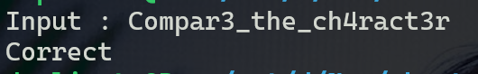

## Chall2 ## 
**Source**
```C
__int64 __fastcall sub_7FF66DED1000(__int64 a1)
{
  int i; // [rsp+0h] [rbp-18h]

  for ( i = 0; (unsigned __int64)i < 18; ++i )
  {
    if ( *(_DWORD *)&aC[4 * i] != *(unsigned __int8 *)(a1 + i) )
      return 0;
  }
  return 1;
}
```
Hàm này so sánh input với aC. aC lấy từ data 
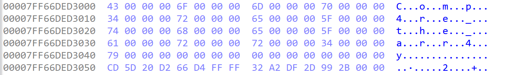
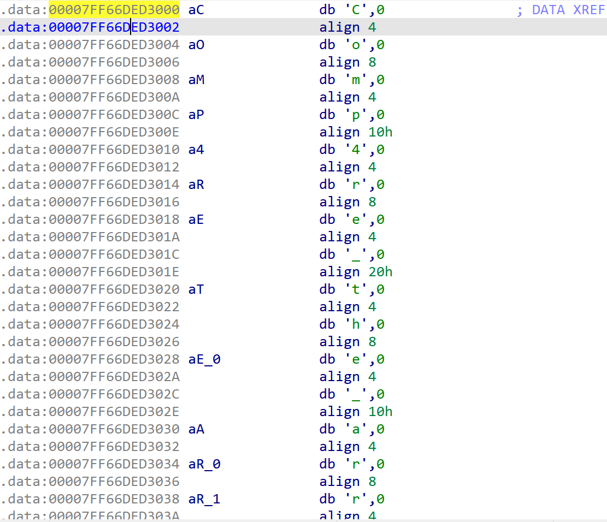
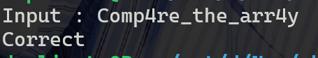

```Python

from Crypto.Util.number import *

data = b'C\x00\x00\x00o\x00\x00\x00m\x00\x00\x00p\x00\x00\x004\x0\x00\x00_\x00\x00\x00a\x00\x00\x00r\x00\x00\x00r\x00\x00\x004\x00\x00\x00y\x00\x00\x00\x00\x00\x00\x00'
res = b''

for i in range (18):
    res += long_to_bytes(data[i * 4])

print(res)

# b'Comp4re_the_arr4y\x00'

```

## Chall3 ##
**Source**
```C
__int64 __fastcall sub_7FF6BC7F1000(__int64 a1)
{
  int i; // [rsp+0h] [rbp-18h]

  for ( i = 0; (unsigned __int64)i < 24; ++i )
  {
    if ( byte_7FF6BC7F3000[i] != (i ^ *(unsigned __int8 *)(a1 + i)) + 2 * i )
      return 0;
  }
  return 1;
}
```
***Sol***
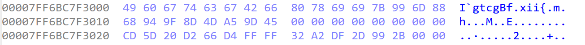
```C
#include <stdio.h>

const unsigned int byte[24] = {0x49, 0x60, 0x67, 0x74, 0x63, 0x67, 0x42, 0x66, 0x80, 0x78, 0x69, 0x69, 0x7B, 0x99, 0x6D, 0x88, 0x68, 0x94, 0x9F, 0x8D, 0x4D, 0xA5, 0x9D, 0x45};

void solve(){
    char a1[24];
    for (int i = 0; i < 24; i++){
        a1[i] = (byte[i] - 2*i) ^ i;
    }
    puts(a1);
}

void main(void){
    solve();
}
```
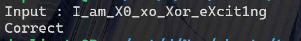

## Chall 4 ##

```C
#include <stdio.h>

const unsigned char byte[28] = {0x24, 0x27, 0x13, 0xC6, 0xC6, 0x13, 0x16, 0xE6, 0x47, 0xF5, 0x26, 0x96, 0x47, 0xF5, 0x46, 0x27, 0x13, 0x26, 0x26, 0xC6, 0x56, 0xF5, 0xC3, 0xC3, 0xF5, 0xE3, 0xE3, 0x00};
void solve(){
    unsigned char a1[28];
    for (int i = 0; i < 28; i++){
        a1[i] = (16 * byte[i]) | (byte[i] >> 4); 
    }  
    puts(a1);
}
int main(){
    solve();
    return 0;
}
// Br1ll1ant_bit_dr1bble_<<_>>
```

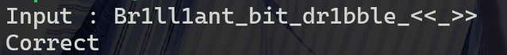

## Chall 5 ##
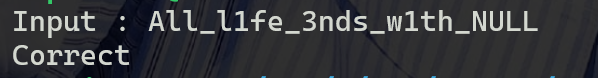
**Source**
```C
__int64 __fastcall sub_140001000(__int64 a1)
{
  int i; // [rsp+0h] [rbp-18h]

  for ( i = 0; (unsigned __int64)i < 24; ++i )
  {
    if ( *(unsigned __int8 *)(a1 + i + 1) + *(unsigned __int8 *)(a1 + i) != byte_140003000[i] )
      return 0;
  }
  return 1;
}
```
**Sol**
```C
#include <stdio.h>

const unsigned char byte[24] = "\xad\xd8\xcb\xcb\x9d\x97\xcb\xc4\x92\xa1\xd2\xd7\xd2\xd6\xa8\xa5\xdc\xc7\xad\xa3\xa1\x98L\x00";

void solve(){
    unsigned char a1[25];
    a1[24] = 0;
    for (int i = 23; i >= 0; i--){
        a1[i] = byte[i] - a1[i + 1];
    }
    puts(a1);
}

void main(void){
    solve();
}
```

## Chall 6 ## 

```C
/*
// Source
__int64 __fastcall sub_140001000(__int64 a1)
{
    int i; // [rsp+0h] [rbp-18h]

    for (i = 0; (unsigned __int64)i < 0x12; ++i)
    {
        if (byte_140003020[*(unsigned __int8 *)(a1 + i)] != byte_140003000[i])
            return 0i64;
    }
    return 1i64;
}

*/
//byte_20[a1[i]] = byte[i]


#include <stdio.h>

const unsigned char byte_20[256] = {0x63, 0x7c, 0x77, 0x7b, 0xf2, 0x6b, 0x6f, 0xc5, 0x30, 0x1, 0x67, 0x2b, 0xfe, 0xd7, 0xab, 0x76, 0xca, 0x82, 0xc9, 0x7d, 0xfa, 0x59, 0x47, 0xf0, 0xad, 0xd4, 0xa2, 0xaf, 0x9c, 0xa4, 0x72, 0xc0, 0xb7, 0xfd, 0x93, 0x26, 0x36, 0x3f, 0xf7, 0xcc, 0x34, 0xa5, 0xe5, 0xf1, 0x71, 0xd8, 0x31, 0x15, 0x4, 0xc7, 0x23, 0xc3, 0x18, 0x96, 0x5, 0x9a, 0x7, 0x12, 0x80, 0xe2, 0xeb, 0x27, 0xb2, 0x75, 0x9, 0x83, 0x2c, 0x1a, 0x1b, 0x6e, 0x5a, 0xa0, 0x52, 0x3b, 0xd6, 0xb3, 0x29, 0xe3, 0x2f, 0x84, 0x53, 0xd1, 0x0, 0xed, 0x20, 0xfc, 0xb1, 0x5b, 0x6a, 0xcb, 0xbe, 0x39, 0x4a, 0x4c, 0x58, 0xcf, 0xd0, 0xef, 0xaa, 0xfb, 0x43, 0x4d, 0x33, 0x85, 0x45, 0xf9, 0x2, 0x7f, 0x50, 0x3c, 0x9f, 0xa8, 0x51, 0xa3, 0x40, 0x8f, 0x92, 0x9d, 0x38, 0xf5, 0xbc, 0xb6, 0xda, 0x21, 0x10, 0xff, 0xf3, 0xd2, 0xcd, 0xc, 0x13, 0xec, 0x5f, 0x97, 0x44, 0x17, 0xc4, 0xa7, 0x7e, 0x3d, 0x64, 0x5d, 0x19, 0x73, 0x60, 0x81, 0x4f, 0xdc, 0x22, 0x2a, 0x90, 0x88, 0x46, 0xee, 0xb8, 0x14, 0xde, 0x5e, 0xb, 0xdb, 0xe0, 0x32, 0x3a, 0xa, 0x49, 0x6, 0x24, 0x5c, 0xc2, 0xd3, 0xac, 0x62, 0x91, 0x95, 0xe4, 0x79, 0xe7, 0xc8, 0x37, 0x6d, 0x8d, 0xd5, 0x4e, 0xa9, 0x6c, 0x56, 0xf4, 0xea, 0x65, 0x7a, 0xae, 0x8, 0xba, 0x78, 0x25, 0x2e, 0x1c, 0xa6, 0xb4, 0xc6, 0xe8, 0xdd, 0x74, 0x1f, 0x4b, 0xbd, 0x8b, 0x8a, 0x70, 0x3e, 0xb5, 0x66, 0x48, 0x3, 0xf6, 0xe, 0x61, 0x35, 0x57, 0xb9, 0x86, 0xc1, 0x1d, 0x9e, 0xe1, 0xf8, 0x98, 0x11, 0x69, 0xd9, 0x8e, 0x94, 0x9b, 0x1e, 0x87, 0xe9, 0xce, 0x55, 0x28, 0xdf, 0x8c, 0xa1, 0x89, 0xd, 0xbf, 0xe6, 0x42, 0x68, 0x41, 0x99, 0x2d, 0xf, 0xb0, 0x54, 0xbb, 0x16};
const unsigned char byte[18] = {0x0, 0x4d, 0x51, 0x50, 0xef, 0xfb, 0xc3, 0xcf, 0x92, 0x45, 0x4d, 0xcf, 0xf5, 0x4, 0x40, 0x50, 0x43, 0x63};
void solve(){
    unsigned char a1[18];
    for (int i = 0; i < 18; i++){
        for (int j = 0; j < 256; j++){
            if (byte_20[j] == byte[i]){
                a1[i] = j;
                break;
            }
        }
    }
    puts(a1);
}

void main(void){
    solve();
}
```

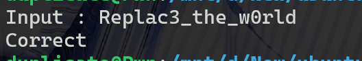


## Chall 8 ##

```C
/*
// Source
__int64 __fastcall sub_140001000(__int64 a1)
{
    int i; // [rsp+0h] [rbp-18h]

    for ( i = 0; (unsigned __int64)i < 21; ++i )
    {
        if ( (unsigned __int8)(-5 * *(_BYTE *)(a1 + i)) != byte_140003000[i] )
        return 0i64;
    }
    return 1i64;
}

*/
//byte_20[a1[i]] = byte[i]


#include <stdio.h>

const unsigned char byte[21] = {0xac, 0xf3, 0xc, 0x25, 0xa3, 0x10, 0xb7, 0x25, 0x16, 0xc6, 0xb7, 0xbc, 0x7, 0x25, 0x2, 0xd5, 0xc6, 0x11, 0x7, 0xc5, 0x0};

int brute(char aByte){
    for (int i = 0; i < 256; i++){
        if ((char)((0xfb * i) & 0xff) == aByte){
            return i;
        }
    }
    puts("Nope!\n");
    return -1;
}

void solve(){
    unsigned char a1[21];
    for (int i = 0; i < 21; i++){
        a1[i] = brute(byte[i]);
    }
    puts(a1);
}

void main(void){
    solve();
}
```
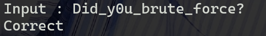


## Chall 7 ##
```C
/*
// Source
__int64 __fastcall sub_140001000(__int64 a1)
{
  int i; // [rsp+0h] [rbp-18h]

  for ( i = 0; (unsigned __int64)i < 31; ++i )
  {
    if ( (i ^ (unsigned __int8)__ROL1__(*(_BYTE *)(a1 + i), i & 7)) != byte_140003000[i] )
      return 0i64;
  }
  return 1i64;
}

*/
//byte_20[a1[i]] = byte[i]


#include <stdio.h>

const unsigned char byte[32] = {0x52, 0xdf, 0xb3, 0x60, 0xf1, 0x8b, 0x1c, 0xb5, 0x57, 0xd1, 0x9f, 0x38, 0x4b, 0x29, 0xd9, 0x26, 0x7f, 0xc9, 0xa3, 0xe9, 0x53, 0x18, 0x4f, 0xb8, 0x6a, 0xcb, 0x87, 0x58, 0x5b, 0x39, 0x1e, 0x0};

unsigned char rotate_right(unsigned char byte, int bit){
    return ((byte << (8 - bit)) | (byte >> bit));
}

void solve(){
    unsigned char a1[31];
    for (int i = 0; i < 31; i++){
        a1[i] = rotate_right(byte[i] ^ i, i & 7);
    }
    puts(a1);
}

void main(void){
    solve();
}
```
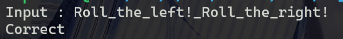


## Chall 9 ##

```C
#include <stdio.h>

const unsigned char byte_20[256] = {0x63, 0x7c, 0x77, 0x7b, 0xf2, 0x6b, 0x6f, 0xc5, 0x30, 0x1, 0x67, 0x2b, 0xfe, 0xd7, 0xab, 0x76, 0xca, 0x82, 0xc9, 0x7d, 0xfa, 0x59, 0x47, 0xf0, 0xad, 0xd4, 0xa2, 0xaf, 0x9c, 0xa4, 0x72, 0xc0, 0xb7, 0xfd, 0x93, 0x26, 0x36, 0x3f, 0xf7, 0xcc, 0x34, 0xa5, 0xe5, 0xf1, 0x71, 0xd8, 0x31, 0x15, 0x4, 0xc7, 0x23, 0xc3, 0x18, 0x96, 0x5, 0x9a, 0x7, 0x12, 0x80, 0xe2, 0xeb, 0x27, 0xb2, 0x75, 0x9, 0x83, 0x2c, 0x1a, 0x1b, 0x6e, 0x5a, 0xa0, 0x52, 0x3b, 0xd6, 0xb3, 0x29, 0xe3, 0x2f, 0x84, 0x53, 0xd1, 0x0, 0xed, 0x20, 0xfc, 0xb1, 0x5b, 0x6a, 0xcb, 0xbe, 0x39, 0x4a, 0x4c, 0x58, 0xcf, 0xd0, 0xef, 0xaa, 0xfb, 0x43, 0x4d, 0x33, 0x85, 0x45, 0xf9, 0x2, 0x7f, 0x50, 0x3c, 0x9f, 0xa8, 0x51, 0xa3, 0x40, 0x8f, 0x92, 0x9d, 0x38, 0xf5, 0xbc, 0xb6, 0xda, 0x21, 0x10, 0xff, 0xf3, 0xd2, 0xcd, 0xc, 0x13, 0xec, 0x5f, 0x97, 0x44, 0x17, 0xc4, 0xa7, 0x7e, 0x3d, 0x64, 0x5d, 0x19, 0x73, 0x60, 0x81, 0x4f, 0xdc, 0x22, 0x2a, 0x90, 0x88, 0x46, 0xee, 0xb8, 0x14, 0xde, 0x5e, 0xb, 0xdb, 0xe0, 0x32, 0x3a, 0xa, 0x49, 0x6, 0x24, 0x5c, 0xc2, 0xd3, 0xac, 0x62, 0x91, 0x95, 0xe4, 0x79, 0xe7, 0xc8, 0x37, 0x6d, 0x8d, 0xd5, 0x4e, 0xa9, 0x6c, 0x56, 0xf4, 0xea, 0x65, 0x7a, 0xae, 0x8, 0xba, 0x78, 0x25, 0x2e, 0x1c, 0xa6, 0xb4, 0xc6, 0xe8, 0xdd, 0x74, 0x1f, 0x4b, 0xbd, 0x8b, 0x8a, 0x70, 0x3e, 0xb5, 0x66, 0x48, 0x3, 0xf6, 0xe, 0x61, 0x35, 0x57, 0xb9, 0x86, 0xc1, 0x1d, 0x9e, 0xe1, 0xf8, 0x98, 0x11, 0x69, 0xd9, 0x8e, 0x94, 0x9b, 0x1e, 0x87, 0xe9, 0xce, 0x55, 0x28, 0xdf, 0x8c, 0xa1, 0x89, 0xd, 0xbf, 0xe6, 0x42, 0x68, 0x41, 0x99, 0x2d, 0xf, 0xb0, 0x54, 0xbb, 0x16};
const unsigned char res[24] = {0x7e, 0x7d, 0x9a, 0x8b, 0x25, 0x2d, 0xd5, 0x3d, 0x3, 0x2b, 0x38, 0x98, 0x27, 0x9f, 0x4f, 0xbc, 0x2a, 0x79, 0x0, 0x7d, 0xc4, 0x2a, 0x4f, 0x58};
const unsigned char key[8] = "I_am_KEY";


unsigned char rotate_left(unsigned char byte, int bit){
    return ((byte >> (8 - bit)) | (byte << bit));
}

void solve(){
    unsigned char a1[24];
    unsigned char block[8];
    for (int index = 0; index < 24; index += 8){
        for (int i = 0; i < 8; i++){
            block[i] = res[index + i];
        }
        for (int i = 0; i < 16; i++){
            for (int j = 7; j >= 0; j--){
                block[(j + 1) & 7] = rotate_left(block[(j + 1) & 7], 5) - byte_20[key[j] ^ block[j]];
            }
        }
        for (int i = 0; i < 8; i++){
            a1[index + i] = block[i]; 
        }
    }
    puts(a1);
}

void main(void){
    solve();
}

```
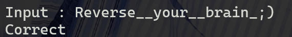


